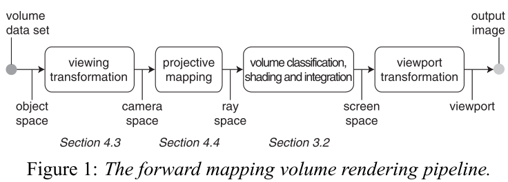

# 3d-gaussian-splatting

<br></br>

# How to create a local environment

You can create a local environment by running following commands.

```bash
conda create -n 3dgs python=3.11
conda activate 3dgs
conda install pytorch torchvision pytorch-cuda=12.1 -c pytorch -c nvidia
pip install -r requirements.txt
```

To download Mip-NeRF 360 dataset, please run the following command.

```bash
bash download_data.sh
```

<br></br>

# Initialization of 3D Gaussians
3D Gaussian splatting reconstructs a 3D environment by optimizing the covariance, position, and color of the 3D Gaussian distribution, but first the 3D Gaussians must be initialized.

We use COLMAP to obtain the initial point cloud and camera matrix for initialization.
Then, we create the initial 3D gaussians. The following elements are initialized. Covariances represent the shape of 3D Gaussians.

- Positions
- Covariances
- Colors
- Opacities

The initial point cloud position is used directly as the initial gaussian position. 
The method for calculating initial covariance is explained in the [original paper](https://repo-sam.inria.fr/fungraph/3d-gaussian-splatting/3d_gaussian_splatting_low.pdf) as follows.

```
We estimate the initial covariance matrix as an isotropic Gaussian with axes equal to the mean of the distance to the closest three points.
```

I used **nearest neighbor search** to get closest three points. This is because the time complexity is $O(n^2)$ for brute force method, but $O(n\log n)$ for nearest neighbor search. [cKDTree](https://docs.scipy.org/doc/scipy/reference/generated/scipy.spatial.cKDTree.html) of scipy is useful to do that. The code is as follows.

```python
def create_initial_covariance(points):
    kdtree = cKDTree(points)
    k = 4  # 1 self-point + 3 nearest neighbors
    distances, indices = kdtree.query(points, k=k)

    radius = np.mean(distances[:, 1:], axis=1)
    covariances = [np.diag([r ** 2, r ** 2, r ** 2]) for r in radius]
    return covariances, radius
```

[**Viser**](https://github.com/nerfstudio-project/viser) is very useful library to visualize 3D information. Therefore, I passed the information of 3D Gaussians(colors, position, radius) and camera matrix to viser to visualize them.

You can visualize initial 3D Gaussians by running following commands.

```bash
cd srcs
python3 visualize_initial_3d_gaussians.py
```


It can be seen that **where there are more point clouds, the radius is smaller, and where there are fewer point clouds, the radius is larger.** This ensures that **there are as few gaps as possible and that the 3D Gaussians do not interfere with each other too much.**

Since the visualization above visualizes position and radius, opacities are irrelevant, but is initialized at $0.1$. For color, the spherical harmonics coefficients are calculated from the RGB of the point cloud.

<br></br>

# EWA Volume Splatting



### Object Space
The coordinate system where the object's geometry is defined. It is local to the object and independent of the world or camera.
For example, A cube might have its vertices defined in object space as
$(−1,−1,−1)$ to $(1,1,1)$ around its local origin. Objects in object space are transformed into **world space** using a **model matrix**.

### Camera Space
The coordinate system relative to the camera (or viewer). After transforming from world space,
objects are expressed in this space to determine their visibility and how they will be projected onto the screen.
Obtained by applying the **view matrix**, which represents the camera's position and orientation in world space.

### Ray Space
A space used to represent rays, typically defined by a ray's origin and direction.
It is not a formal coordinate system but a conceptual framework for ray-tracing operations.
Rays are transformed between spaces (e.g., from world space to object space) using inverse transformations.

$$
R(t)=O+t⋅D
$$

- $O$: Origin of the ray.
- $D$: Direction of the ray (normalized).
- $t$: Parameter controlling the position along the ray.

### Screen Space
The 2D coordinate system corresponding to the pixels of the display or image being rendered.
This is the final stage of the rendering pipeline.
Objects are projected from camera space into screen space using the **projection matrix** and subsequent viewport scaling.

<br></br>

# References

- [3D Gaussian Splatting for Real-Time Radiance Field Rendering](https://repo-sam.inria.fr/fungraph/3d-gaussian-splatting/)
- [Viser](https://github.com/nerfstudio-project/viser)
- [EWA Volume Splatting](https://www.cs.umd.edu/~zwicker/publications/EWAVolumeSplatting-VIS01.pdf)
